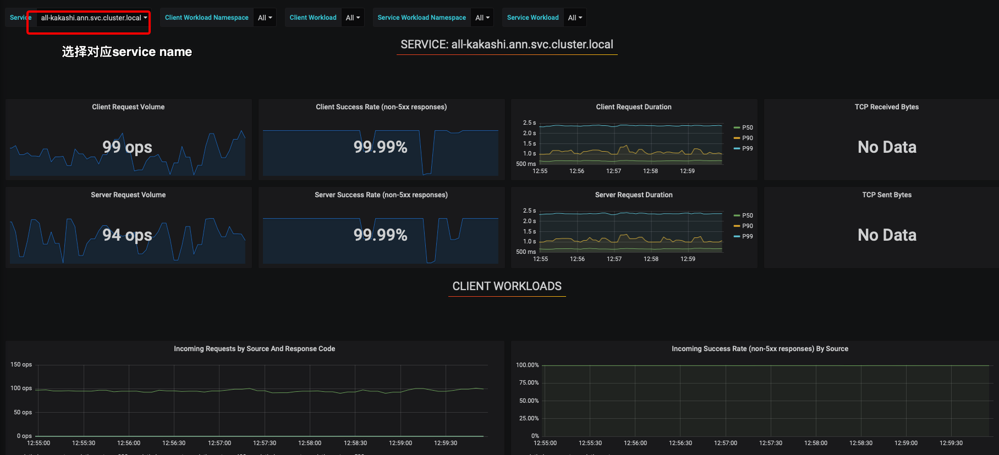

# 使用方法

请勿在本项目上传敏感文件

使用前，请先阅读本文档!!!

## New

### V1.1

1. 对于旁路模型(消费like实时流数据，但是不需要回调人审接口，例如年龄模型，embedding模型，或者不定期的刷库)强烈推荐直接用[offline](https://git.sysop.bigo.sg/infer-serving/flask-deploy/tree/offline)的方式部署，后续将引入定制化的[HPA策略](https://kubernetes.io/zh/docs/tasks/run-application/horizontal-pod-autoscale/)

2. 更细致的资源粒度，按机器分配改为按GPU分配，告别恼人的Gunicorn

3. 自定义监控Metrics，自定义告警策略，引入公司监控平台
4. 允许不同集群配置不同的Replicas
5. 自定义初始化延迟时间
6. 新的集群，升级Istio，k8s版本，增强稳定性，更多可拓展的特征
7. 引入公司ELK平台


## Feature

### 离线Inference

`server.cc`只是给了一个简单的Pipeline, 具体实现各位尽情发挥

离线Inference上游数据来源为线上同一个Kafka Topic，经过解码，Inference等步骤得到模型结果，然后写入另外一个Kafka/DB/TXT

需要注意，使用线上kafka的时候请和工程同学进行沟通，避免离线模型过多，kafka消费压力过大，对线上的审核流程产生影响

另外，离线模型需要注意监控和告警的加入，避免挂了都没人知道，可以直接使用公司的[多维监控](https://git.sysop.bigo.sg/infer-serving/flask-deploy/blob/master/doc/监控系统接入说明_其他.docx)

我们也会通过Prometheus收集各个程序的metrics，后续将开放集群Metrics告警

如果是自己的一些批量刷库任务，不知道程序结果如何汇总，可以直接写大数据的测试kafka集群，无需申请，自己创建一个Topic即可，不过测试kafka集群的过期时间是1天，需要自己进行持久化操作

测试kafka集群地址: dn590.jja.bigo-out:9094,dn591.jja.bigo-out:9094,dn592.jja.bigo-out:9094

测试kafka manager地址: http://139.5.108.236:8080/clusters/kafka_prod_test_env


### 细化资源分配粒度

增加conf.py中增加 `gpu_memory`字段，`Int`类型，2080Ti可分配资源为10G

注意，`gpu_memory`只是一个声明，它并不检查程序实际占用，如果程序在运行过程中，显存出现增长，也不会有cpu memory的oom处理措施

有了按卡分配，我们完全可以抛弃Gunicorn，由k8s/brpc来实现lb。在实际业务中，Gunicorn非常容易出现4卡负载不均衡的问题，一卡有难，3卡围观

GPU分配，可以拥有更多的Pod，假定之前我们replicas为4，gunicorn worker为8，意味着单卡分配两个process；转为按卡分配，我们可以提升8倍Pod的数量，对故障恢复更加友好

因为Pod提升了8倍，我们需要将原本的cpu & memory 的申请量除以8，否则资源不足

根据`like-core-porn-softporn`,`flag`,`cover`等模型的测试，由k8s进行lb，消除负载不均衡的问题后，单机吞吐量可提升50%-100%


### 自定义监控

允许自定义的[Metrics](https://prometheus.io/docs/concepts/metric_types/)

通过 [Python Prometheus](https://github.com/prometheus/client_python)收集metrics至公司监控平台，可以自定义任何metrics，例如解码集群下载时延，模型推理时延，失败数目等，并加入对应的告警策略


公司监控平台Grafana: http://metrics-sysop.bigo.sg/d/LJ_uJAvmk/istio-service-dashboard?orgId=1&refresh=10s

后续可自定义每个服务的可视化面板

所有集群的metrcs都会被收集到公司的Grafana显示

也可以访问各个集群独立的Grafana

```
infer-na:  http://infer-na.grafana.bigoml.cc:3000
infer-eu:  http://infer-eu.grafana.bigoml.cc:3000
infer-hk:  http://infer-hk.grafana.bigoml.cc:3000
infer-jja: http://infer-jja.grafana.bigoml.cc:3000
eu-infer:  http://eu-infer.grafana.bigoml.cc:3000

```


### 更灵活的Replicas

增加

`hk_replicas`

 `eu_replicas`

`na_replcias`


### 自定义初始化时间

ML普遍存在初始化时间过慢的问题

有些模型如果初始化未完成，就收到请求，会产生各种奇奇怪怪的问题，k8s通过探测`/api/ping `来获取服务状态，返回200为正常，当k8s多次探测服务处于不正常状态，会重启服务。`init_delay_second`会将探测器启动的时间延后，避免启动时间过长，k8s认为程序异常，无限restart的问题


### 集群升级

1. 删除us集群，新建infer-na集群，istio版本为1.6.0

2. 新建infer-eu集群，eu-infer集群保留特征库服务

3. 新建infer-hk集群，infer-jja保留无法迁移的服务

   ```
   1. infer-na: 流量入口 infer-na.ingress.bigoml.cc
   2. infer-eu: 流量入口 infer-eu.ingress.bigoml.cc
   3. infer-hk: 流量入口 infer-hk.ingress.bigoml.cc
   4. infer-jja: 流量入口 infer-jja.ingress.bigoml.cc
   5. eu-infer: 流量入口 eu-infer.ingress.bigoml.cc
   
   ```

   

### 日志中心

查询地址: http://log-query.basic.bigo.inner:8089/#/

使用wiki: http://wiki.bigo.sg:8090/pages/viewpage.action?pageId=186123426

持续完善中，目前eu/hk大部分服务都接入了日志中心

我们的Log名称为` macl_${namespace}_${servicename}_$(date)`

注意，Docker日期为零时区，收集Log以东八区为标准


## 定位

本套框架适用于以下场景

- 小流量
- 带有实验性质的短期测试
- 初版模型，追求快速上线

如果是大流量模型，计划长期运行的核心模型，建议使用更高效率(调度方式)的框架

原则上，replicas数量 > 5 请使用[brpc-deploy](https://git.sysop.bigo.sg/infer-serving/brpc-deploy)


样例是给出了[Gunicorn](https://gunicorn.org)+[Flask](https://flask.palletsprojects.com/en/1.1.x/)的部署模式，平台基础架构为[K8S](https://kubernetes.io) + [istio](https://istio.io/zh/)组成的service mesh

不过这只是建议使用场景，根据实际情况和个人情况完全可以自定义一个Docker image，自定义K8S [deployment](https://kubernetes.io/zh/docs/concepts/workloads/controllers/deployment/)，根据CI提供的集群接入权限，实现全新的部署方式

不过在使用此方式前，请先和工程人员进行协商，避免影响集群其他服务的运行(尤其是自定义Router)


## 配置

修改`value.py`

```
service_name = "demo"  # 独特的服务名，禁止与他人服务名重复
username = "like"      # {“like”, “imo”, "bigolive", "hello"}

# K8S config
cpu = 8                # 单个程序最多需要使用的CPU数目/ 一台机器只有32 Thread
memory = "24Gi"        # 单个程序最大需要使用的内存数，超过限制会oom，程序会重启/ 一台机器只有 128Gi
replicas = 1           # 部署的副本数/受限于资源池，假定demo只分配了3台机器，replicas填100也只会分配3个副本
ab_replicas = 1.       # ab测试所用资源，目前ab分配了5台hk机器

# gunicorn config，在使用BigoMLServiceMini时生效
gpu_num = 1            # 使用GPU的数量，一般填4
ins_num_per_gpu = 1    # 每块GPU使用多少个BMLS Instance
model_path = ""        # 模型路径
bmls_ret_type = ""     # BMLS返回类型，详见BMLS文档

# decode sidecar config
use_decode_sidecar =   # 是否使用decode sidecar，详见“解码”

# srv config
use_srv = False
host_port = 19999  #是否使用kong 作为服务发现, 以及暴露的服务端口 (建议服务间host_port不同)
```

禁止修改conf其他文件


## 程序

- `simple-server.py` 最简单的Flask接口实现
- `server-with-share-memory.py` 基于decode sidecar & BMLS 的server实现，应用示例可见`physical-tag`分支
- `server-with-opencv.py` 基于Opencv && BMLS的server实现

   实际部署只使用`server.py`，请修改`server.py`文件

修改src/server.py

必须实现以下路由

`/api/ping` `/api/${service_name}`

如有必要，可以修改Dockerfile


#### Gunicorn

本程序使用Flask + Gunicorn的部署形式

用Gunicorn控制进程&线程数目，并对请求进行分发

Gunicorn 的相关配置可见, src/conf.py

`worker`是程序的进程数，一般为`gpu_num`的整数倍，每个进程在启动之前会写一个pid文件，pid文件里面写入进程所使用的GPU索引。由此控制GPU被各个进程均匀分配

具体代码逻辑可见 `src/conf.py/per_fork` 与 `/src/server-with-share-memory.py L52-55`


Gunicorn在实际使用中，会因为session的原因，导致负载不均衡，这种情况在并发数较小的时候尤为严重

另外，此框架在我们的场景下排队情况也很严重，假定每个worker只接受2个请求，有4个worker，而client端发送了64个请求，那么同时会有56个请求被阻塞在框架中，server端用户代码对此是无感知的。不过这种排队的阻塞时间会被client的请求时间和基础时延监控(见基础监控)统计出来

此外，Gunicorn的工作模式是多进程，如果有四张GPU，我们启动4个work，每张GPU一个worker，这是最优情况。可实际情况是4个worker通常无法达到一个较好的吞吐量，那我们启动12个worker，每个GPU会分配到3个进程，程序的吞吐量会有一定的提升，不过多进程间的GPU context切换是一个超级慢的操作(MPS并不是很好使)，这也是Gunicorn的一个缺点

通常，我们建议在一个进程内多开一些Instance，尽量让单进程的负载最大化。不过由于我们的选型，Flask是一个很孱弱的框架，更由于GIL的存在，Instance数目开到4左右，就不会带来任何提升了，全卡在了反序列化/payload解析等Python代码上


#### Model

模型文件请放置于`model`,建议使用LFS

不过由于公司Git LFS的配置，超过1GB的文件就无法直接上传(反而普通git格式可以上传几G的文件)，此时建议先对文件进行split，然后在编译镜像的时候进行Merge操作

具体步骤

1. 在shell使用split分割模型

   `split -b 500000000 model.bin model.bin-`

2. 提供merge脚本，供编译镜像是使用

3. 修改Dockerfile文件，在编译过程中增加model merge操作

Demo:

https://git.sysop.bigo.sg/infer-serving/brpc-deploy/blob/like_core/model/merge.sh

https://git.sysop.bigo.sg/infer-serving/brpc-deploy/blob/like_core/Dockerfile#L6


## 输入

与请求发送方协商, 一般为Post Json, 必须字段如下: postid/uid/seqid, video/image/data


## 输出

与业务方协商，一般为Json，必须字段如下: msg(optional，错误信息) results(结果)


## Bigo-ML-Service-Mini

建议使用Bigo-ML-Service实现前后处理逻辑

BigoMLServiceMini可使用Python接口调用，示例代码可见src/server**py


## 解码

目前的视频解码有两种方式

1. 集成在server程序中，由自己实现

   可调用OpenCV

   可调用[decode_video](https://git.sysop.bigo.sg/bigo_ml_service/decode_video)(yangxingping@bigo.sg)

   其它解码方式

   

2. 由decode sidecar解码，decoder sidecar类似一个透明代理，接受到视频请求后，将视频按秒抽帧解码放到共享内存中，再将共享内存的信令转发给后续的实际模型程序(即`server.py`)

   具体代码可见`src/server-with-share-memory.py`。注意，需在`conf/value.py`将`use_decode_sidecar`置为`True`

   具体使用示例可见: `physical-tag`分支

   decode sidecar由brpc编写，可以提供相关brpc的流量监测工具，并内置了相应的多维告警监控

   缺点是不够灵活，会产生额外的内存拷贝开销

   如果是like核心审核流程，需要处理视频实时上传流，建议使用decode sidecar，避免多次解码开销
   
   


## 服务发现
可选 使用kong3 作为服务发现供后台寻找可用实例

kong3通过访问实例IP:host_port/api/ping进行探活， 实际业务调用端口为8080

使用前请联系@阳兴平 @洪浩强


## CI/CD

提交代码，所有业务相关代码都不会合并到Master分支

请新建Branch提交


CI分为5个步骤: 

- build

  根据DockerFile编译镜像，上传harbor

  根据配置文件，特化k8s部署文件(可在gitlab artifacts下载，过期时间一个月)

  

- grey

  灰度测试，目前使用美洲集群机型灰度测试

  对应程序状态在Racher us集群 CI/CD中寻找

  灰度测试强制replica为1， 可请求API： `107.155.44.110:8080/grey/${service_name}`

  `./test.py`是一个简单的测试脚本

  

- stop_grey

  停止灰度测试，开始部署生产环境流程

  

- deploy

  - ab_test

    ab测试，目前在hk分配了5台机器专用于ab测试，此处资源无需申请

    对应程序状态请在Rancher infer-jja集群 CI/CD中寻找

    使用的时候请自己协调资源，测试结束后请及时在ci中停止测试，释放资源(方便他人，方便自己，多谢)

    对应的API: `jja-gpu150.bigoml.cc:8080/api/ab-test/${service_name}`

    

  - deploy[**-cluster]

    目前总共支持3个大区的集群: 美洲大区[us]，欧洲大区[eu]，亚洲大区[hk]

    上线正式程序，生产环境资源需要邮件申请，具体细节见此[文档](doc/生产环境计算资源申请.md)

    对应程序状态请在Rancher infer-jja集群 CI/CD中寻找

    对应API: `jja-gpu150.bigoml.cc:8080/api/${username}/${service_name}`


- Rancher

  地址: https://admin.bigoml.cc/login

  账号: algorithm

  密码: algorithm

  algorithm账号仅有严格限制的只读权限，所有人共用

  各个team拥有一个可写的账号 @梁柱锦 @刘运 @刘振强 @杨睿智

  一般情况下，不再下发可写权限，如有特殊情况，请联系@阳兴平


## 监控

### 基础监控

istioctl为每个Service都提供了相应的基础监控，包括服务时延/成功率/失败率/请求大小/返回大小/QPS等

[灰度Grafana](http://172.96.115.82:3000)

[香港Grafana](http://jja-gpu150.bigoml.cc:3000)

user: admin

passwd: Bigo1992





如果使用了sidecar, sidecar内部集成了成功率/失败率/程序重启等企业微信告警的策略，由于sidecar是BRPC编写，也提供了[BRPC单机监控能力](https://github.com/apache/incubator-brpc/blob/master/docs/cn/builtin_service.md)


### 自定义监控

- [BIGO多维监控](./doc/监控系统接入说明_其他.docx)

- 集群自定义Metrics: TODO


## 优化建议

1. 首先当然得知道程序的具体运行情况，参见[程序效率评估](./doc/程序效率评估.md)
2. 使用Batch处理（增大BatchSize） > 增大单个GPU instance > 增大worker数目 > 增加replicas
3. 原则是尽量增加单个程序的吞吐量，而非增大replicas。如果单个程序可以跑满单台四卡物理机，我们非常乐意为此程序分配独占的物理机。否则，在利用率未满的情况下，服务器上肯定还会运行其他应用程序
4. 请求是图片信息，请考虑增加Batch处理，图片的Batch处理可令吞吐量增加一个数量级
5. 请求是视频信息，而实际使用图片模型，也请增加batch处理，设置一个合理的BatchSize，依照经验，likee视频的平均时长为17s，建议BatchSize尽量大于17s
6. 优化的核心思路，第一步是增加资源利用率，第二步是减少计算量，最后是减少不必要的IO
7. 分析程序瓶颈，IO/CPU/GPU，可以申请登录灰度机器的权限，在灰度机器上查看程序运行时相关资源消耗情况
8. IO瓶颈，这个很难说，也不常见，得看具体case
9. CPU瓶颈，分为几种情况，一种是CPU解码的开销过大，建议换为GPU解码。另外一种是程序含有Detection模型，比较吃CPU资源，这种得具体分析，不过换成cpp预处理准是可行的
10. GPU瓶颈，一般来说GPU成为瓶颈的程序，代码层面的实现都是不错的。先尝试直接使用FP16进行Inference，如果效率仍未达到要求，此时得考虑模型剪枝，蒸馏等操作。更好的一个解决办法是使用[TensorRT](https://developer.nvidia.com/tensorrt)
11. 如果以上方法都尝试过了，仍未达到满意效果，可能可以从Pipeline层面进行一些优化，或者可以从硬件层面进行一些协调，请联系相关工程同学


- 其它

  简单介绍一下单进程内针对单卡启动多个BMLS instance/Graph object 的优点

  针对MxNet框架，大部分重操作都是异步执行的，框架实现了一个Scheduler组件，所有异步操作都被发送到scheduler的queue里面，都被scheduler安排的明明白白。因为实际的执行者只有scheduler一个，所以基本不存在内核级别的context切换问题。当scheduler队列被塞满后，也不会存在GPU利用率断崖式上升/下跌等问题

  因为Scheduler是单例实现，一个进程里面就只会有一个scheduler，此时无论开启了多少个BMLS object，也只是让scheduler队列更加充实，而不会增加context调度开销

  其实CPU的context的切换对我们来说影响不大，重点在于GPU Context切换, Kernel Launch, Memory Copy切换等操作对效率影响巨大。Nvidia也推出了一套[MPS](https://docs.nvidia.com/deploy/mps/index.html)的工具来解决这个问题，在我的测试下，这个工具一直表现欠佳，所以现在服务器未开启MPS，如果对此有需求，请联系工程同学


## TODO

1. 丰富多维监控配置，增加多维监控文档[Done]
2. 增加Metric 与PGA相关配置
3. 增加数据流来源控制
4. 增加Istio组件及文档
5. 可选部署集群/机房
6. 增加业务亲和性
7. 增加企业微信机器人通知
8. 增加上线时间段限制


# FQA


- 如何Merge至Master

  Master不接受业务代码merge，所有需要上线的模型，请自己创建一个branch，自己维护，暂时不需要Merge至Master

  

- 项目克隆过慢

  指定Branch和Depth

    `git clone -b master https://git.sysop.bigo.sg/infer-serving/flask-deploy --depth=1`

  

- Fail to find method on `/api/${service_name}'

  - 检查是否实现了`/api/${service_name}`路由

  - 路由冲突问题

    Service_name 为test-2，之前已经有一个branch的名字为test，并且没有在ci中stop-test，那么访问/api/grey/test-2 的请求都实际会发送到/api/grey/test上

    此时需要在`test` 分支的ci pipeline中停止旧版本即可，或者重新命名自己的branch，避免冲突

    路由冲突问题仅在某一个旧branch name是新branch name的字串的时候出现

     test/test-1；test/test-yxp 会出现

     test-v1.0/test-v1.1不会出现

    

- no health upstream

  - 服务程序还未启动，请确认rancher中对应部署的状态为成功后再次尝试

  - 路由冲突问题

    

- Gunicorn LOG信息:  Handling signal: term

  - 启动超时，gunicorn认为程序未存活，自动restart，可尝试增大src/conf.py time默认值
  - oom了，程序被kill。可尝试增大value.py 中 memory参数
  - 启动超时, K8S probe认为程序未存活，自动restart，修改探针配置信息即可. 在conf/template/deploy*.yaml 搜索  `initialDelaySeconds`字段，修改为对应的初始化时间即可。注意，初始化时间和instance数和模型大小成正比
  
  
  
- Rancher 上看到程序一直是Unavailable状态

  - 是否有restart记录，如无，可能启动较慢，等待即可
  
  - 有restart记录，可以查看LOG，选择"Previous Container"，查看最后一次restart输出的LOG，一般都是程序启动超时导致，可见上条FQA "Gunicorn LOG信息: Handling signal:term"
  
    

- Rancher 上看到程序一直是Scheduling状态
  - 集群的灰度测试资源不足/ 正式环境未分配相关资源
  - 没有机器能够满足程序的需求，例如将value.py的Memory写为128Gi，每台机器最大内存为128G，并且有一些集群后台程序会占据小量内存。所以没有机器能够满足部署条件，无法分配相关资源
  
  

More info: yangxingping@bigo.sg


# TempoBeatsEstimation
