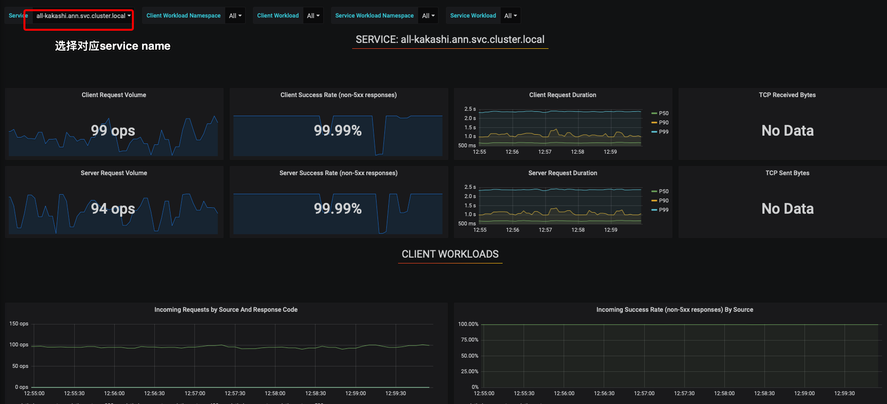
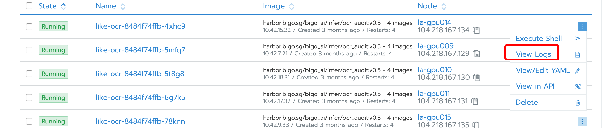
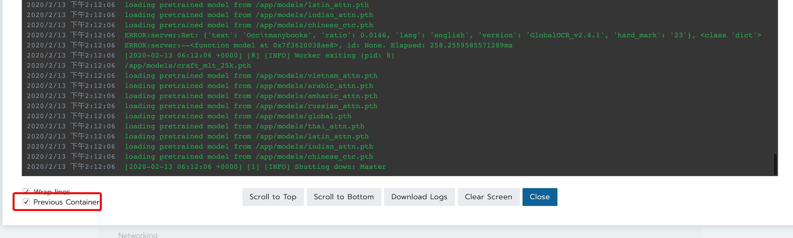
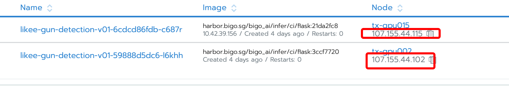

# 程序效率评估

### 主体流程

1. 在模型在进行部署流程之前，使用者对此程序将会占用的资源量有一个大概的评估

2. 将评估量写入value.py，进行集群的灰度测试
3. 灰度环境部署成功后，用户向程序发送请求，控制请求的并发量，可以分别得出不同QPS下，程序不同的资源使用情况，和程序性能表现数据

### 服务指标

[灰度Grafana](http://172.96.115.82:3000)

[香港Grafana](http://jja-gpu150.bigoml.cc:3000)

user: admin

passwd: Bigo1992

对应所有service，我们都需要关心下列指标

- QPS

  最高QPS即为程序的最大吞吐量

  

- 时延

  client request duration:  客户端发送请求到接收到结果的耗时

  server request duration: 服务端接收到请求到返回的耗时

  正常来说，这两个时延应该基本一致，不过当网络发生剧烈波动的时候，client端的耗时会高于server的耗时

  耗时图表中有三条线。以P99为例，将所有请求耗时排序后，99%的请求的时延小于P99的值

  图表最高时延为10s，即请求耗时超过了10s，将无法在图表中体现出来

  

- 成功/失败率

  成功率在QPS负载过高时可能会略有降低，一般而言，正常程序的成功率不能低于99%

  

- 重启记录

  程序重启记录在rancher可以看到

  

  同时框架会记录下每个pod最近一次重启的所有log

  

  

  

  有重启记录表示程序存在bug，正常情况是无法上线的。

  重启可以简单分为三种，

  1. coredump重启，程序存在致命漏洞，将产生coredump文件，此类情况绝对不予上线，上线后程序一旦restart，产生的corefile将写满物理机硬盘，导致k8s所有pod被驱逐，整台物理机将陷入无法使用的状态

  2. 配置错误，例如，oom，增大程序memory使用限制即可；k8s probe failed，常见于模型初始化阶段，调大initdelay的时间即可；gunicorn timeout，一个请求在发送后超过一定的时间，如果没有返回结果，gunicorn认定程序hang了，对程序进行重启，增大相应timeout时间即可

  3. 其他错误，segment fault，硬件错误... 试具体case而定

     

### 物理资源

可以申请对应的灰度机器登录权限，直接登录程序所在机器，通过top/nvidia-smi等shell命令即可获得对应程序的资源使用情况

Rancher可以看到程序使用的具体物理机ip

cmdb申请物理机登录权限即可

常用评估命令: top/nvidia-smi/nvidia-smi dmon/docker stats

cpu usage/memory usage/gpu usage/ cuda memory usage 这些都可以直接通过命令直接获取

不过gpu usage这个在存在其他模型在同机器运行的情况下，gpu context切换对效率产生的影响会比较大，建议评估前先确认此物理机是否有其他程序在运行

如果有其他程序的模型占据了显存，不过没有请求过来，这是不会对效率产生任何影响的

判断其他模型有无请求的最简单办法，先停止service的client端请求，通过nvidia-smi查看显卡是否有利用率

程序在首次灰度测试时相应的资源可以申请多一些，确认具体的资源利用率后，再改为实际需求的资源量